### Hi there 👋  I am Raghavendran S

- 🔭 I’m currently working as Java Developer.
- 🌱 In my pass-time, I am experimenting with ReactJS, Clean code, Applying Design patterns.
- 📫 You can reach me through: [![Twitter][1.2]][1], or [![LinkedIn][2.2]][2]
- ⚡ Fun fact: I'm interested in 
  - Travel 
   - Coffee Lover :coffee:
 

<!-- Icons -->

[1.2]: http://i.imgur.com/wWzX9uB.png (twitter icon without padding)
[2.2]: https://raw.githubusercontent.com/MartinHeinz/MartinHeinz/master/linkedin-3-16.png (LinkedIn icon without padding)

<!-- Links to your social media accounts -->

[1]: https://twitter.com/kenduraghav
[2]: https://www.linkedin.com/in/raghavendran-karthik/

<!--
 -->

## My GitHub Stats

